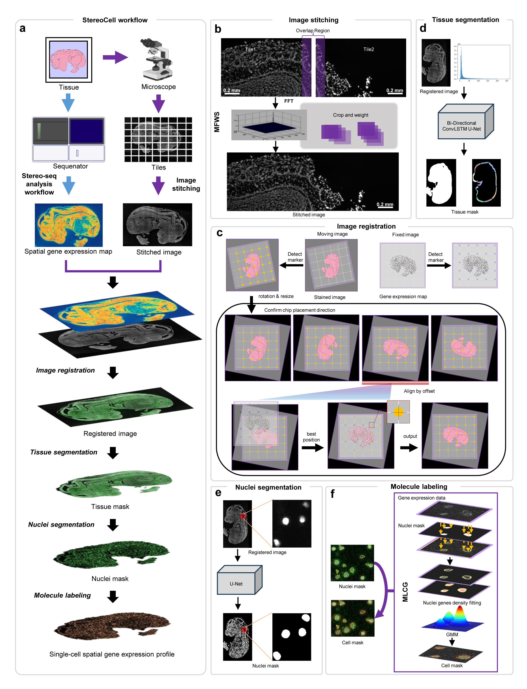

# StereoCell

<div align="center">
  
    <h6>
      StereoCell: An integrated technology and software analysis suite for spatial single-cell expression profiling.
    </h6>
</div>
<br>

## Installation
* Clone repo and install requirements.txt in a ```python==3.8``` environment, including [onnxruntime==1.13.1](https://onnx.ai/).
```text
# python3.8
conda create --name=StereoCell python=3.8
conda activate StereoCell
git clone https://github.com/BGIResearch/StereoCell  # clone
cd StereoCell
pip install -r requirements.txt  # install
```
* install ```pyvips```, The following is referenced from [pyvips](https://libvips.github.io/pyvips/README.html#non-conda-install)

**On Windows**, first you need to use pip to install like,
```text
$ pip install --user pyvips==2.2.1
```
then you need to download the compiled library from [vips-dev-8.12](https://github.com/libvips/libvips/releases),
To set PATH from within Python, you need something like this at the start:

```python
import os
vipshome = 'c:\\vips-dev-8.7\\bin'
os.environ['PATH'] = vipshome + ';' + os.environ['PATH']
```

**On Linux**,
```text
$ conda install --channel conda-forge pyvips
```
* Download & setup CNN weights file<br>

| weights                 | dst dir                               |
|-------------------------|---------------------------------------|
| [sold2_wireframe.tar](https://pan.genomics.cn/ucdisk/s/naMzYr) | cellbin\iqc\trackCross_net\sold2\ckpt |
| [stereocell_bcdu_cell_256x256_220926.pth](https://pan.genomics.cn/ucdisk/s/mU3umq)                    | cellbin\weights                       |
| [stereocell_bcdu_tissue_512x512_220822.onnx](https://pan.genomics.cn/ucdisk/s/bQVbYv)                    | cellbin\weights                       |


## Tutorials

### Test Data
Here is a [mouse brain](https://ftp.cngb.org/pub/stomics/STT0000027/Analysis/STSA0000247/STTS0000393/) data set, which is generated by BGI STOmics, including gene matrix and raw image data.<br>
The purpose of open-sourcing this data set is to promote the research of spatial single-cell data in the field of life 
sciences through algorithms. STOmics reserves the right to interpret it.

### Command Line
It supports stitching, tissue segmentation, cell segmentation and Cell labeling, also supports whole pipeline analysis of StereoCell.
in pipeline analysis, arguments are described as follows:

*  ```--input```  Image data produced by microscopy. 
* ```--matrix``` Gene matrix of [Stereo-seq](https://bgi-australia.com.au/stomics). 
* ```--chipno``` Serial number of STOmics chip. 
* ```--output``` The output path of single cell gene matrix produced by StereoCell. 

```shell
cd scripts

# Pipeline
python .\pipeline.py \
--input D:\data\test\SS200000135TL_D1 \
--matrix D:\data\test\SS200000135TL_D1.gem.gz  \
--output D:\data\test
--chipno SS200000135TL_D1

# Stitching
python .\stitching.py \
--input D:\data\test\SS200000135TL_D1\SS200000135TL_D1
--output D:\data\test\stitched.tif

# Tissue segmentation
python .\segmentation.py \
--type tissue
--input D:\StereoCell\data\image_6467_16800_512_512.tif \
--output D:\StereoCell\data\image_tissue.tif \

# Cell segmentation
python .\segmentation.py \
--type cell
--input D:\StereoCell\data\image_6467_16800_512_512.tif \
--output D:\StereoCell\data\image_cell.tif \

# Cell labeling
python labeling.py \
--mask_path D:\StereoCell\data\cell_mask.tif \
--gem_path D:\StereoCell\data\gene.gem.gz \
--out_path D:\StereoCell\data
```
[More details](docs/details.md)

### GUI
For some low-quality input data, using the StereoCell pipeline will get wrong results. We have developed a manual tool 
based on [pyqt5](https://pypi.org/project/PyQt5/) to adapt to this scenario, you can get it through the [cloud disk](https://pan.genomics.cn/ucdisk/s/FZB3Qf). 
We have sorted out the details of installation and operation into the [User Manual](docs/CellbinStudio_Manual_20221212.pdf), which will help you get started quickly.
The Mainwindow is shown in the figure below,
<div align="center">
  
    <h6>
      Fig 1 Main window of CellBinStudio
    </h6>
</div>

## License and Citation <br>
StereoCell is released under the MIT license. Please cite StereoCell in your publications if it helps your research: <br>
```text
@article {Li2023.02.28.530414,
	author = {Li, Mei and Liu, Huanlin and Li, Min and Fang, Shuangsang and Kang, Qiang and Zhang, Jiajun},
	title = {StereoCell enables high accuracy single cell segmentation for spatial transcriptomic dataset},
	year = {2023},
	URL = {https://www.biorxiv.org/content/early/2023/03/01/2023.02.28.530414},
	journal = {bioRxiv}
}
```

    
## Reference <br>
> https://github.com/matejak/imreg_dft <br>
> https://github.com/rezazad68/BCDU-Net <br>
> https://github.com/libvips/pyvips <br>
